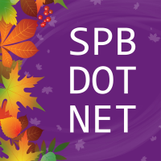
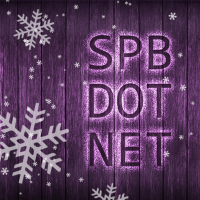
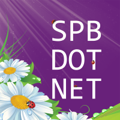
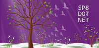
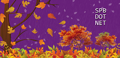
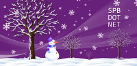

# SpbSeasons

#### spbdotnet-logo-squared-spring

|       |
| :---: |
|       |
|  |
| Скачать: [PNG×200](https://raw.githubusercontent.com/kulakovt/SpbDotNet/master/Art/SpbSeasons/spbdotnet-logo-squared-spring-200.png), [PNG×800](https://raw.githubusercontent.com/kulakovt/SpbDotNet/master/Art/SpbSeasons/spbdotnet-logo-squared-spring-800.png) |

#### spbdotnet-logo-squared-autumn

|       |
| :---: |
|       |
|  |
| Скачать: [PNG×200](https://raw.githubusercontent.com/kulakovt/SpbDotNet/master/Art/SpbSeasons/spbdotnet-logo-squared-autumn-200.png), [PNG×1000](https://raw.githubusercontent.com/kulakovt/SpbDotNet/master/Art/SpbSeasons/spbdotnet-logo-squared-autumn-1000.png) |

#### spbdotnet-logo-squared-winter

|       |
| :---: |
|       |
|  |
| Скачать: [PNG×200](https://raw.githubusercontent.com/kulakovt/SpbDotNet/master/Art/SpbSeasons/spbdotnet-logo-squared-winter-200.png), [PNG×600](https://raw.githubusercontent.com/kulakovt/SpbDotNet/master/Art/SpbSeasons/spbdotnet-logo-squared-winter-600.png) |

#### spbdotnet-logo-squared-summer

|       |
| :---: |
|       |
|  |
| Скачать: [PNG×200](https://raw.githubusercontent.com/kulakovt/SpbDotNet/master/Art/SpbSeasons/spbdotnet-logo-squared-summer-200.png), [PNG×1000](https://raw.githubusercontent.com/kulakovt/SpbDotNet/master/Art/SpbSeasons/spbdotnet-logo-squared-summer-1000.png) |

#### spbdotnet-banner-spring

|       |
| :---: |
|       |
|  |
| Скачать: [PNG×200](https://raw.githubusercontent.com/kulakovt/SpbDotNet/master/Art/SpbSeasons/spbdotnet-banner-spring-200.png), [PNG×1162](https://raw.githubusercontent.com/kulakovt/SpbDotNet/master/Art/SpbSeasons/spbdotnet-banner-spring-1162.png), [PNG×1248](https://raw.githubusercontent.com/kulakovt/SpbDotNet/master/Art/SpbSeasons/spbdotnet-banner-spring-1248.png) |

#### spbdotnet-banner-autumn

|       |
| :---: |
|       |
|  |
| Скачать: [PNG×200](https://raw.githubusercontent.com/kulakovt/SpbDotNet/master/Art/SpbSeasons/spbdotnet-banner-autumn-200.png), [PNG×1200](https://raw.githubusercontent.com/kulakovt/SpbDotNet/master/Art/SpbSeasons/spbdotnet-banner-autumn-1200.png), [PNG×1248](https://raw.githubusercontent.com/kulakovt/SpbDotNet/master/Art/SpbSeasons/spbdotnet-banner-autumn-1248.png) |

#### spbdotnet-banner-winter

|       |
| :---: |
|       |
|  |
| Скачать: [PNG×200](https://raw.githubusercontent.com/kulakovt/SpbDotNet/master/Art/SpbSeasons/spbdotnet-banner-winter-200.png), [PNG×1200](https://raw.githubusercontent.com/kulakovt/SpbDotNet/master/Art/SpbSeasons/spbdotnet-banner-winter-1200.png), [PNG×1248](https://raw.githubusercontent.com/kulakovt/SpbDotNet/master/Art/SpbSeasons/spbdotnet-banner-winter-1248.png) |

#### spbdotnet-banner-summer

|       |
| :---: |
|       |
|  |
| Скачать: [PNG×200](https://raw.githubusercontent.com/kulakovt/SpbDotNet/master/Art/SpbSeasons/spbdotnet-banner-summer-200.png), [PNG×1200](https://raw.githubusercontent.com/kulakovt/SpbDotNet/master/Art/SpbSeasons/spbdotnet-banner-summer-1200.png), [PNG×1248](https://raw.githubusercontent.com/kulakovt/SpbDotNet/master/Art/SpbSeasons/spbdotnet-banner-summer-1248.png) |

