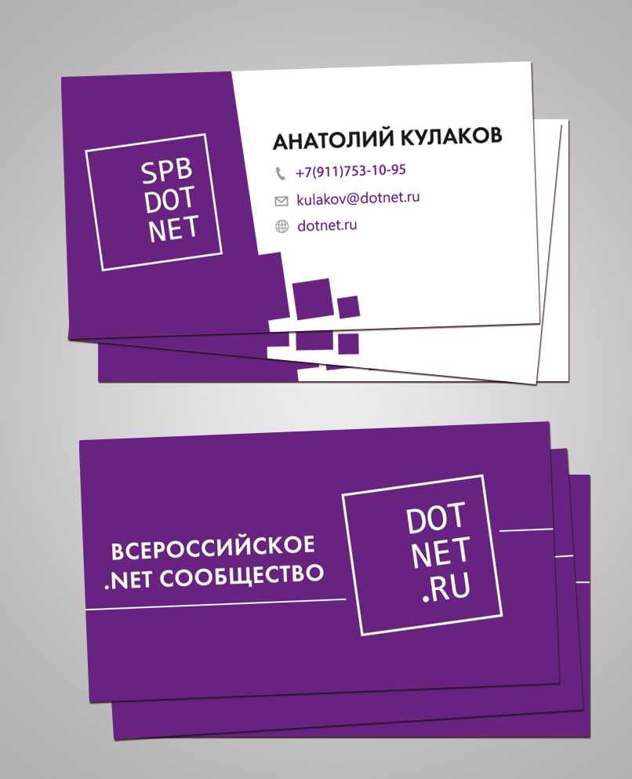

# Визитки

Лицевая (`Front`) и оборотная (`Back`) сторона визитки. Обе и в `AI`, и в `PDF`. Ещё шрифты, для тех надписей, которые не преобразованы в кривые.

## Оформление

Перед печатью на Лицевой (`Front`) стороне необходимо изменить:

1. Имя и фамилия
2. Номер телефона
3. E-Mail адрес
4. Логотип локального сообщества

## Пример

