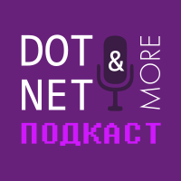

# DotNet & More

Подкаст о DotNet разработке и не только. Официальный сайт [dotnetmore.ru](https://dotnetmore.ru/). Хэштег в социальных сетях _#dotnetmore_.

## Логотип

Не стесняйтесь использовать наши логотипы при упоминании подкаста.

### Форматы

- Используйте **PNG×200** только для предпросмотра или демонстрации.
- Используйте **PNG×800** как основной формат распостранения, например в социальных сетях.
- Используйте **EPS** для полиграфической продукции.
- Используйте **SVG** для получения логотипа любого другого необходимого формата или размера (без потери качества).

### Не нужно

- Изменять пропорции логотипов.
- Изменять цвета логотипов.
- Помещать текст или другие элементы поверх логотипов.
- Изменять шрифт или положение надписи на логотипах.
- Вставлять в логотип ссылку никак не связанную с подкастом.

### Варианты

#### Квадрат

На светлом фоне используйте логотип без рамки. Подходит для создания круглых миниатюр в соц. сетях.

|       |
| :---: |
|       |
|  |
| Скачать: [SVG](https://raw.githubusercontent.com/kulakovt/SpbDotNet/pod-logo/Logo/More/dotnetmore-logo-squared.svg), [PNG×200](https://raw.githubusercontent.com/kulakovt/SpbDotNet/pod-logo/Logo/More/dotnetmore-logo-squared-200.png), [PNG×800](https://raw.githubusercontent.com/kulakovt/SpbDotNet/pod-logo/Logo/More/dotnetmore-logo-squared-800.png), [EPS](https://raw.githubusercontent.com/kulakovt/SpbDotNet/pod-logo/Logo/More/dotnetmore-logo-squared.eps) |

#### Квадрат с рамкой

На тёмном фоне используйте логотип с рамкой.

|       |
| :---: |
|       |
|  |
| Скачать: [SVG](https://raw.githubusercontent.com/kulakovt/SpbDotNet/pod-logo/Logo/More/dotnetmore-logo-squared-bordered.svg), [PNG×200](https://raw.githubusercontent.com/kulakovt/SpbDotNet/pod-logo/Logo/More/dotnetmore-logo-squared-bordered-200.png), [PNG×800](https://raw.githubusercontent.com/kulakovt/SpbDotNet/pod-logo/Logo/More/dotnetmore-logo-squared-bordered-800.png), [EPS](https://raw.githubusercontent.com/kulakovt/SpbDotNet/pod-logo/Logo/More/dotnetmore-logo-squared-bordered.eps) |

