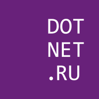
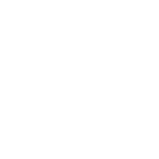

# DotNetRu

Объединение независимых русскоязычных .NET сообществ.

- Официальный сайт: [dotnet.ru](https://dotnet.ru/).
- Хэштег в социальных сетях: _#dotnetru_.

## Логотип

Не стесняйтесь использовать наши логотипы при упоминании нас или любых наших активностей.

### Форматы

- Используйте **PNG×200** только для предпросмотра или демонстрации.
- Используйте **PNG×800** как основной формат распостранения, например в социальных сетях.
- Используйте **EPS** для полиграфической продукции.
- Используйте **SVG** для получения логотипа любого другого необходимого формата или размера (без потери качества).

### Не нужно

- Изменять пропорции логотипов.
- Изменять цвета логотипов.
- Помещать текст или другие элементы поверх логотипов.
- Изменять шрифт или положение надписи на логотипах.
- Размещать на неконтрастном фоне прозрачную версию логотипа.
- Вставлять в логотип ссылку никак не связанную с нашим проектом.

### Варианты

Подбирайте вариант логотипа наиболее подходящий под ваши конкретные нужды.

#### Квадрат

На светлом фоне используйте логотип без рамки. Подходит для создания круглых миниатюр в соц. сетях.

|       |
| :---: |
|       |
|  |
| Скачать: [SVG](https://raw.githubusercontent.com/DotNetRu/BrandBook/master/Logo/Ru/dotnetru-logo-squared.svg), [PNG×200](https://raw.githubusercontent.com/DotNetRu/BrandBook/master/Logo/Ru/dotnetru-logo-squared-200.png), [PNG×800](https://raw.githubusercontent.com/DotNetRu/BrandBook/master/Logo/Ru/dotnetru-logo-squared-800.png), [EPS](https://raw.githubusercontent.com/DotNetRu/BrandBook/master/Logo/Ru/dotnetru-logo-squared.eps) |

#### Квадрат с рамкой

На тёмном фоне используйте логотип с рамкой.

|       |
| :---: |
|       |
|  |
| Скачать: [SVG](https://raw.githubusercontent.com/DotNetRu/BrandBook/master/Logo/Ru/dotnetru-logo-squared-bordered.svg), [PNG×200](https://raw.githubusercontent.com/DotNetRu/BrandBook/master/Logo/Ru/dotnetru-logo-squared-bordered-200.png), [PNG×800](https://raw.githubusercontent.com/DotNetRu/BrandBook/master/Logo/Ru/dotnetru-logo-squared-bordered-800.png), [EPS](https://raw.githubusercontent.com/DotNetRu/BrandBook/master/Logo/Ru/dotnetru-logo-squared-bordered.eps) |

#### Квадрат на прозрачном фоне

На тёмном цветном фоне используйте прозрачный логотип.

|       |
| :---: |
|       |
|  |
| Скачать: [SVG](https://raw.githubusercontent.com/DotNetRu/BrandBook/master/Logo/Ru/dotnetru-logo-squared-white.svg), [PNG×200](https://raw.githubusercontent.com/DotNetRu/BrandBook/master/Logo/Ru/dotnetru-logo-squared-white-200.png), [PNG×800](https://raw.githubusercontent.com/DotNetRu/BrandBook/master/Logo/Ru/dotnetru-logo-squared-white-800.png), [EPS](https://raw.githubusercontent.com/DotNetRu/BrandBook/master/Logo/Ru/dotnetru-logo-squared-white.eps) |

#### Квадрат на прозрачном фоне с рамкой

На тёмном цветном фоне используйте прозрачный логотип с рамкой.

|       |
| :---: |
|       |
|  |
| Скачать: [SVG](https://raw.githubusercontent.com/DotNetRu/BrandBook/master/Logo/Ru/dotnetru-logo-squared-white-bordered.svg), [PNG×200](https://raw.githubusercontent.com/DotNetRu/BrandBook/master/Logo/Ru/dotnetru-logo-squared-white-bordered-200.png), [PNG×800](https://raw.githubusercontent.com/DotNetRu/BrandBook/master/Logo/Ru/dotnetru-logo-squared-white-bordered-800.png), [EPS](https://raw.githubusercontent.com/DotNetRu/BrandBook/master/Logo/Ru/dotnetru-logo-squared-white-bordered.eps) |

## Шрифты

В нашем логотипе используется шрифт Consolas ™. Это шрифт по-умолчанию который используют .NET разработчики в своих редакторах кода.

См. также:

- [Consolas font family from Microsoft](https://docs.microsoft.com/en-us/typography/font-list/consolas)
- [Consolas from Wikipedia](https://en.wikipedia.org/wiki/Consolas)

## Цвета

Цветовая схема сообщества снована на цветах официального [логотипа .NET Foundation](https://github.com/dotnet/swag/tree/master/logo).

|             |  [Пурпурный](https://www.color-hex.com/color/68217a) |  [Фиолетовый](https://www.color-hex.com/color/cf18fd) |  [Белый](https://www.color-hex.com/color/ffffff) |
| ----------- | ---------- | ------------ | ------------- |
| **Web**     | #68217a    | #cf18fd      | #ffffff       |
| **RGB**     | 104,33,122 | (207,24,253) | (255,255,255) |
| **CMYK**    | 15,73,0,52 | 18,91,0,1    | 0,0,0,0       |
| **Pantone** | 259 C      | 246 C        | White         |

## См. также

- [.NET Brand Guidelines](https://github.com/dotnet/brand)

