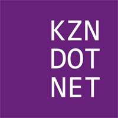
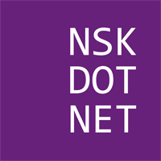
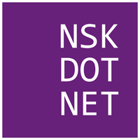
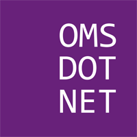
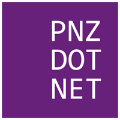
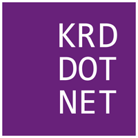
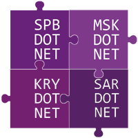
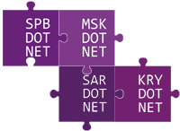
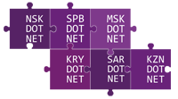

# DotNetRu пожитки

Графические оформления используемые для украшения пожитков (майки, наклейки, кружки, магниты и т.д.).

- Логотипы без рамки хорошо подходят для светлого фона.
- Логотипы с белой рамкой лучше использовать для тёмных фонов.
- Белые логотипы на прозрачной подложке идеальны когда нужно использовать существующий фон. 

## Логотипы

Основные логотипы сообществ.

| Предпросмотр        | Информация         |
| ------------------- |--------------------|
|  | Логотип DotNetRu |
|  | Логотип DotNetRu с белой рамкой |
|  | Логотип DotNetRu на прозрачном фоне |
|  | Логотип SpbDotNet |
|  | Логотип SpbDotNet с белой рамкой |
|  | Логотип SpbDotNet на прозрачном фоне |
|  | Логотип MskDotNet |
|  | Логотип MskDotNet с белой рамкой |
|  | Логотип MskDotNet на прозрачном фоне |
|  | Логотип SarDotNet |
|  | Логотип SarDotNet с белой рамкой |
|  | Логотип SarDotNet на прозрачном фоне |
|  | Логотип KryDotNet |
|  | Логотип KryDotNet с белой рамкой |
|  | Логотип KryDotNet на прозрачном фоне |
|  | Логотип KznDotNet |
|  | Логотип KznDotNet с белой рамкой |
|  | Логотип KznDotNet на прозрачном фоне |
|  | Логотип NskDotNet |
|  | Логотип NskDotNet с белой рамкой |
|  | Логотип EkbDotNet |
|  | Логотип EkbDotNet с белой рамкой |
|  | Логотип EkbDotNet на прозрачном фоне |
|  | Логотип OmsDotNet |
|  | Логотип OmsDotNet с белой рамкой |
|  | Логотип UfaDotNet |
|  | Логотип UfaDotNet с белой рамкой |
|  | Логотип NnvDotNet |
|  | Логотип NnvDotNet с белой рамкой |
|  | Логотип PnzDotNet |
|  | Логотип PnzDotNet с белой рамкой |
|  | Логотип SamDotNet |
|  | Логотип SamDotNet с белой рамкой |
|  | Логотип KrdDotNet |
|  | Логотип KrdDotNet с белой рамкой |

## Две столицы

Дизайнерские этюды на тему SpbDotNet и MskDotNet сообществ.

| Предпросмотр        | Информация         |
| ------------------- |--------------------|
|  | Две столицы с лентой |
|  | Две столицы в корсете |
|  | Две столицы в сердце |
|  | Две столицы в мозайке |
|  | Две столицы с логотипом VisualStudio |
|  | Две столицы с логотипом VisualStudio с белой рамкой |
|  | Две столицы как объёмные инь и ян |
|  | Две столицы как плоские инь и ян |

## Бригада

Дизайнерские этюды на тему всех сообществ (по мере появления).

| Предпросмотр        | Информация         |
| ------------------- |--------------------|
|  | Четыре команды в квадратной мозайке |
|  | Четыре команды в бесконечной мозайке |
|  | Шесть команд в квадратной мозайке |
|  | Шесть команд в бесконечной мозайке |
