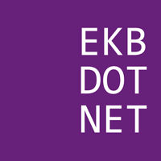
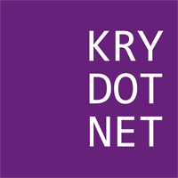
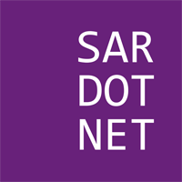
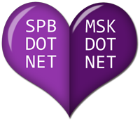
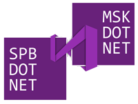

# DotNet.Ru пожитки

Графические оформления используемые для украшения пожитков (майки, наклейки, кружки и т.д.)

## Логотипы

Логотипы с белой рамкой лучше использовать для тёмных фонов. Без рамки хорошо подходят для светлого фона.

| Предпросмотр        | Информация         |
| ------------------- |--------------------|
|  | Логотип SpbDotNet |
|  | Логотип SpbDotNet с белой рамкой |
|  | Логотип MskDotNet |
|  | Логотип MskDotNet с белой рамкой |
|  | Логотип EkbDotNet |
|  | Логотип EkbDotNet с белой рамкой |
|  | Логотип KryDotNet |
|  | Логотип KryDotNet с белой рамкой |
|  | Логотип SarDotNet |
|  | Логотип SarDotNet с белой рамкой |

## Две столицы

Дизайнерские этюды на тему SpbDotNet и MskDotNet сообществ.

| Предпросмотр        | Информация         |
| ------------------- |--------------------|
|  | Две столицы с лентой |
|  | Две столицы в корсете |
|  | Две столицы в сердце |
|  | Две столицы в мозайке |
|  | Две столицы с логотипом VisualStudio |
|  | Две столицы с логотипом VisualStudio с белой рамкой |
|  | Две столицы как объёмные инь и ян |
|  | Две столицы как плоские инь и ян |
